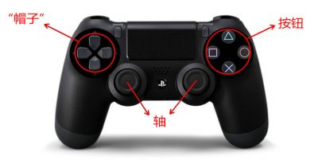
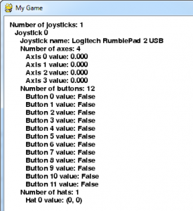

# joystick | Pygame中文文档

## pygame.joystick

>与游戏杆、游戏手柄、追踪球进行交互的 pygame 模块。

## 函数

* pygame.joystick.init()  —  初始化 joystick 模块
* pygame.joystick.quit()  —  卸载 joystick 模块
* pygame.joystick.get_init()  —  如果 joystick 模块已经初始化，返回 True
* pygame.joystick.get_count()  —  临时设置某些组合键为被按下状态

## 类

* pygame.joystick.Joystick  —  新建一个 Joystick 对象

joystick 模块用来管理电脑上游戏杆类的设备。游戏杆类的设备包括追踪球和游戏手柄。这个模块允许使用多个按钮和“帽键”。计算机可同时管理多个游戏杆类设备。

以 PS4 次世代游戏手柄为例，本文出现的名称含义如下:



Joystick 类的每个实例代表一个插入电脑的游戏设备。如果一个游戏手柄上有多个游戏杆，在这个游戏设备上，一个 Joystick 对象可代表多个游戏杆。
用下面的代码可快速初始化 joystick 模块并且获得 Joystick 实例的列表：

    pygame.joystick.init()
    joysticks = [pygame.joystick.Joystick(x) for x in range(pygame.joystick.get_count())]

以下事件类型由 joysticks 生成：

> JOYAXISMOTION JOYBALLMOTION JOYBUTTONDOWN JOYBUTTONUP JOYHATMOTION

由于事件队列中的对象需要经常调用一些方法才能正常工作，所以 pygame.event.get，pygame.event.wait 或 pygame.event.pump 函数将会被经常用到。

## 函数详解

`pygame.joystick.init()`

初始化 joystick 模块。

init() -> None

这个函数被 pygame.init() 自动调用。

这个函数初始化 joystick 模块，将会扫描系统上所有的游戏杆设备。这个模拟块初始化后其他函数才能工作。

多次调用这个函数是没问题的。

`pygame.joystick.quit()`

卸载 joystick 模块。

quit() -> None

卸载 joystick 模块。

在你调用这个函数之后，任何游戏杆对象都不会再工作。

多次调用这个函数是没问题的。

`pygame.joystick.get_init()`

如果 joystick 模块已经初始化，返回 True。

get_init() -> bool

测试 pygame.joystick.init() 是否已经被调用。

`pygame.joystick.get_count()`

返回游戏杆的数量。

get_count() -> count

返回在系统上游戏杆设备的数量；如果没有操纵杆设备，返回 0。

当你用 Joystick(id) 创建一个 joystick 对象，你输入的数字（参数）必须小于这个数。

## 类 pygame.joystick.Joystick

创建一个新的 Joystick 对象。

Joystick(id) -> Joystick

方法

* pygame.joystick.Joystick.init()  —  初始化
* pygame.joystick.Joystick.quit()  —  卸载Joystick
* pygame.joystick.Joystick.get_init()  —  检查Joystick是否初始化
* pygame.joystick.Joystick.get_id()  —  获得Joystick ID
* pygame.joystick.Joystick.get_name()  —  获得 Joystick 系统名称
* pygame.joystick.Joystick.get_numaxes()  —  获得 Joystick 操纵轴的数量
* pygame.joystick.Joystick.get_axis()  —  获得操纵轴的当前坐标
* pygame.joystick.Joystick.get_numballs()  —  获得 Joystick 上追踪球的数量
* pygame.joystick.Joystick.get_ball()  —  获得追踪球的相对位置
* pygame.joystick.Joystick.get_numbuttons()  —  获得 Joystick 上按钮的数量
* pygame.joystick.Joystick.get_button()  —  获得当前按钮状态
* pygame.joystick.Joystick.get_numhats()  —  获得 Joystick 上帽键的数量
* pygame.joystick.Joystick.get_hat()  —  获得 的位置

创建一个新的 Joystick 来访问物理设备。这个 id 的值必须在 0 到 pygame.joystick.get_count() - 1 之间。

你需要初始化 Joystick 来调用大多数 Joystick 函数。这是独立于 joystick 模块的初始化。当多个 Joystick 对象在同一个物理设备上创建时（它们拥有相同的 ID 值），这些 Joystick 对象的状态和数值将会共享。

Joystick 对象允许你获得 Joystick 设备上控制器类型的信息。一旦这个设备从 Pygame 事件队列初始化，它将会开始对其输入接收事件。

你可以在未初始化 Joystick 对象时，调用 Joystick.get_name() 和 Joystick.get_id() 方法。

### 方法详解

`pygame.joystick.Joystick.init()`

初始化 Joystick。

init() -> None

Joystick 必须被初始化来获得大多数有关控制的信息。

当 Joystick 初始化之后，Pygame 事件队列将获取 Joystick 的输入。

多次调用这个方法是安全的。

`pygame.joystick.Joystick.quit()`

卸载 Joystick。

quit() -> None

这将卸载 Joystick。

卸载之后，Pygame 事件队列将不再接收设备传来的事件。

多次调用这个方法是没问题的。

`pygame.joystick.Joystick.get_init()`

检查 Joystick 是否已经初始化。

get_init() -> bool

当这个 Joystick 对象已经调用 init() 函数初始化时，将返回 True。

`pygame.joystick.Joystick.get_id()`

获得 Joystick 的 ID。

get_id() -> int

返回代表这个设备的整型 ID 值。

这和传递到 Joystick() 构造函数的值是一样的。

即便没有初始化 Joystick，调用这个方法也是安全的。

`pygame.joystick.Joystick.get_name()`

获得 Joystick 系统的名称。

get_name() -> string

返回这个 Joystick 设备的系统名称。

系统分配给 Joystick 的名称是不确定的，但可以确保是唯一的名称来代表这个设备。

即便没有初始化 Joystick，调用这个方法也是安全的。

`pygame.joystick.Joystick.get_numaxes()`

获得 Joystick 操纵轴的数量。

get_numaxes() -> int

返回在 Joystick 上操纵轴的数量。

一般有两个操纵轴用来表示坐标（rudders 和 throttles 被视为附加操纵轴）。
pygame.JOYAXISMOTION 的值是从 -1. 0到 1.0。0.0 表示轴在中间。

游戏手柄通常只用 -1，0，1 三个值，并且没有其他中间值。

旧的模拟操纵轴并不是总用完整 -1 到 1 的范围，而是在 0 左右的值。

模拟操纵轴经常受到一些干扰的影响，这将会导致一些小而快速的移动事件。

`pygame.joystick.Joystick.get_axis()`

获得操纵轴的当前坐标。

get_axis(axis_number) -> float

获得操纵轴的当前坐标，其值是从 -1.0 到 1.0，0 在中间。

你可能需要考虑一些额外的盈余来处理抖动，偏移值是在 0 的上下游动。

轴的数量必须是从 0 到 get_numaxes() - 1 的数字。

`pygame.joystick.Joystick.get_numballs()`

获得 Joystick 上追踪球的数量。

get_numballs() -> int

得到 Joystick 上追踪球的数量。

这些设备和鼠标相似，但是它没有绝对的坐标，它只有相对移动数值。

当球转动的时候，会发送 pygame.JOYBALLMOTION 事件，这将会报告球移动的距离。

`pygame.joystick.Joystick.get_ball()`

获得追踪球的相对位置。

get_ball(ball_number) -> x, y

返回 Joystick 追踪球的相对移动位置。

数值是自上次调用 get_ball 后的相对移动数值，以 x, y 表示。

追踪球的数量必须是从 0 到 get_numballs() - 1 的数字。

`pygame.joystick.Joystick.get_numbuttons()`

获得 Joystick 上按钮的数量。

get_numbuttons() -> int

返回 Joystick 上按钮的数量。

这些按钮有一个布尔状态（开或关）。

当按钮被按下或抬起的时候，会产生 pygame.JOYBUTTONDOWN 和 pygame.JOYBUTTONUP 事件。

`pygame.joystick.Joystick.get_button()`

获得当前按钮的状态。

get_button(button) -> bool

返回当前按钮状态。

`pygame.joystick.Joystick.get_numhats()`

获得 Joystick 上帽键的数量。

get_numhats() -> int

返回 Joystick 上帽键的数量。帽键就像 Joystick 上的微型数码操纵杆。每个帽键有两个轴作为输入。

当帽键改变坐标的时候，会产生 pygame.JOYHATMOTION 事件。事件的位置属性包含一对数值，这些值可以是 -1，0 或1 。(0, 0) 表示帽键在中间。

`pygame.joystick.Joystick.get_hat()`

获得 Joystick 上帽键的位置。

get_hat(hat_number) -> x, y

返回帽键的当前位置。

位置包含 x，y 两个值。(0, 0) 表示在中间。-1 代表左/下，1 代表右/上。(x 对应左右, y 对应上下)。所以 (-1, 0) 代表左，(1, 0) 代表右，(0, 1) 代表上，(1, 1) 代表右上。

值只能取 -1, 0, 1 不允许其他值。

帽键的数量必须在 0 到 get_numhats() - 1 之间。

## 代码示例

```Python
    import pygame

    # Define some colors
    BLACK    = (   0,   0,   0)
    WHITE    = ( 255, 255, 255)

    # This is a simple class that will help us print to the screen
    # It has nothing to do with the joysticks, just outputting the
    # information.
    class TextPrint:
        def __init__(self):
            self.reset()
            self.font = pygame.font.Font(None, 20)

        def print(self, screen, textString):
            textBitmap = self.font.render(textString, True, BLACK)
            screen.blit(textBitmap, [self.x, self.y])
            self.y += self.line_height
            
        def reset(self):
            self.x = 10
            self.y = 10
            self.line_height = 15
            
        def indent(self):
            self.x += 10
            
        def unindent(self):
            self.x -= 10
       

    pygame.init()

    # Set the width and height of the screen [width,height]
    size = [500, 700]
    screen = pygame.display.set_mode(size)

    pygame.display.set_caption("My Game")

    #Loop until the user clicks the close button.
    done = False

    # Used to manage how fast the screen updates
    clock = pygame.time.Clock()

    # Initialize the joysticks
    pygame.joystick.init()
       
    # Get ready to print
    textPrint = TextPrint()

    # -------- Main Program Loop -----------
    while done==False:
        # EVENT PROCESSING STEP
        for event in pygame.event.get(): # User did something
            if event.type == pygame.QUIT: # If user clicked close
                done=True # Flag that we are done so we exit this loop
            
            # Possible joystick actions: JOYAXISMOTION JOYBALLMOTION JOYBUTTONDOWN JOYBUTTONUP JOYHATMOTION
            if event.type == pygame.JOYBUTTONDOWN:
                print("Joystick button pressed.")
            if event.type == pygame.JOYBUTTONUP:
                print("Joystick button released.")
                

        # DRAWING STEP
        # First, clear the screen to white. Don't put other drawing commands
        # above this, or they will be erased with this command.
        screen.fill(WHITE)
        textPrint.reset()

        # Get count of joysticks
        joystick_count = pygame.joystick.get_count()

        textPrint.print(screen, "Number of joysticks: {}".format(joystick_count) )
        textPrint.indent()
       
        # For each joystick:
        for i in range(joystick_count):
            joystick = pygame.joystick.Joystick(i)
            joystick.init()
       
            textPrint.print(screen, "Joystick {}".format(i) )
            textPrint.indent()
       
            # Get the name from the OS for the controller/joystick
            name = joystick.get_name()
            textPrint.print(screen, "Joystick name: {}".format(name) )
            
            # Usually axis run in pairs, up/down for one, and left/right for
            # the other.
            axes = joystick.get_numaxes()
            textPrint.print(screen, "Number of axes: {}".format(axes) )
            textPrint.indent()
            
            for i in range( axes ):
                axis = joystick.get_axis( i )
                textPrint.print(screen, "Axis {} value: {:>6.3f}".format(i, axis) )
            textPrint.unindent()
                
            buttons = joystick.get_numbuttons()
            textPrint.print(screen, "Number of buttons: {}".format(buttons) )
            textPrint.indent()

            for i in range( buttons ):
                button = joystick.get_button( i )
                textPrint.print(screen, "Button {:>2} value: {}".format(i,button) )
            textPrint.unindent()
                
            # Hat switch. All or nothing for direction, not like joysticks.
            # Value comes back in an array.
            hats = joystick.get_numhats()
            textPrint.print(screen, "Number of hats: {}".format(hats) )
            textPrint.indent()

            for i in range( hats ):
                hat = joystick.get_hat( i )
                textPrint.print(screen, "Hat {} value: {}".format(i, str(hat)) )
            textPrint.unindent()
            
            textPrint.unindent()

       
        # ALL CODE TO DRAW SHOULD GO ABOVE THIS COMMENT
       
        # Go ahead and update the screen with what we've drawn.
        pygame.display.flip()

        # Limit to 20 frames per second
        clock.tick(20)
       
    # Close the window and quit.
    # If you forget this line, the program will 'hang'
    # on exit if running from IDLE.
    pygame.quit ()
```

运行结果：

