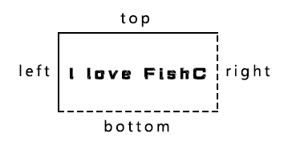

# Rect | Pygame 中文文档

## class pygame.Rect

>Rect 是用于存储矩形坐标的 Pygame 对象。

Rect(left, top, width, height) -> Rect

Rect((left, top), (width, height)) -> Rect

Rect(object) -> Rect

## 属性 & 方法

* pygame.Rect.copy()  —  拷贝 Rect 对象
* pygame.Rect.move()  —  移动 Rect 对象
* pygame.Rect.move_ip()  —  原地移动 Rect 对象
* pygame.Rect.inflate()  —  放大和缩小 Rect 对象的尺寸
* pygame.Rect.inflate_ip()  —  原地放大和缩小 Rect 对象的尺寸
* pygame.Rect.clamp()  —  将一个 Rect 对象移动到另一个 Rect 对象的中心
* pygame.Rect.clamp_ip()  —  原地将一个 Rect 对象移动到另一个 Rect 对象的中心
* pygame.Rect.clip()  —  获取两个 Rect 对象互相重叠的部分
* pygame.Rect.union()  —  将两个 Rect 对象合并
* pygame.Rect.union_ip()  —  原地将两个 Rect 对象合并
* pygame.Rect.unionall()  —  将多个 Rect 对象合并
* pygame.Rect.unionall_ip()  —  原地将多个 Rect 对象合并
* pygame.Rect.fit()  —  按照一定的宽高比调整 Rect 对象
* pygame.Rect.normalize()  —  翻转 Rect 对象（如果尺寸为负数）
* pygame.Rect.contains()  —  检测一个 Rect 对象是否完全包含在该 Rect 对象内
* pygame.Rect.collidepoint()  —  检测一个点是否包含在该 Rect 对象内
* pygame.Rect.colliderect()  —  检测两个 Rect 对象是否重叠
* pygame.Rect.collidelist()  —  检测该 Rect 对象是否与列表中的任何一个矩形有交集
* pygame.Rect.collidelistall()  —  检测该 Rect 对象与列表中的每个矩形是否有交集
* pygame.Rect.collidedict()  —  检测该 Rect 对象是否与字典中的任何一个矩形有交集
* pygame.Rect.collidedictall()  —  检测该 Rect 对象与字典中的每个矩形是否有交集

Pygame 通过 Rect 对象存储和操作矩形区域。一个 Rect 对象可以由 left，top，width，height 几个值创建。Rect 也可以是由 Pygame 的对象所创建，它们拥有一个属性叫“rect”。

任何需要一个 Rect 对象作为参数的 Pygame 函数都可以使用以上值构造一个 Rect。这样使得作为参数传递的同时创建 Rect 成为可能。

Rect 对象中的大部分方法在修改矩形的位置、尺寸后会返回一个新的 Rect 拷贝，原始的 Rect 对象不会有任何改变。但有些方法比较特殊，它们会“原地”修改 Rect 对象（也就是说它们会改动原始的 Rect 对象），这些方法都会以 "ip" 作为后缀（注："ip" 即 "in-place" 的缩写，“原地”的意思）。

对了方便大家移动和对齐，Rect 对象提供以下这些虚拟属性：
x,y
top, left, bottom, right
topleft, bottomleft, topright, bottomright
midtop, midleft, midbottom, midright
center, centerx, centery
size, width, height
w,h

上边这些属性均可以被赋值，例如：

```Python
rect1.right = 10
rect2.center = (20,30)
```

给 size，width，height 属性赋值将改变矩形的尺寸；给其它属性赋值将移动矩形。注意：一些属性是整数，一些是整数对。

如果一个 Rect 对象的 width 或 height 非 0，那么将在非 0 测试中返回 True。一些方法返回尺寸为 0 的 Rect 对象，用于表示一个非法的矩形。

Rect 对象的坐标都是整数，size 的值可以是负数，但在大多数情况下被认为是非法的。

还有一些方法可以实现矩形间碰撞检测，大多数 Python 的容器可以用于检索其中的元素与某个 Rect 对象是否碰撞。

Rect 对象覆盖的范围并不包含 right 和 bottom 指定的边缘位置。

一图胜千言：


